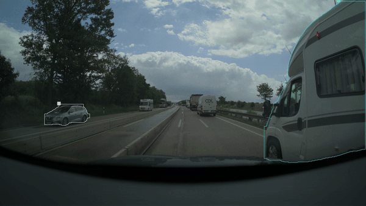

# Zenseact Open Dataset (ZOD) - Object Detection, Segmentation, and Tracking

This project demonstrates object detection, segmentation, and tracking on the Zenseact Open Dataset (ZOD) using advanced deep learning models, including YOLO and Faster R-CNN. The results are visualized through the GIFs below.

## Visualizations

### Object Detection

  

### Object Segmentation

  

## Notebooks Overview

### Object Detection, Segmentation, and Tracking with YOLO (`zod_od.ipynb`)

This notebook focuses on object detection using the YOLO (You Only Look Once) model. Additionally, it includes functionality for object segmentation and tracking, providing a comprehensive pipeline from dataset preparation to advanced vision tasks.

**Key Features:**

1. **Dataset Conversion:**  
   - The notebook provides code to convert the ZOD dataset into the YOLO format, which is essential for training YOLO models.
   
2. **Object Detection with YOLO:**  
   - Implements the YOLO architecture to detect objects such as vehicles, pedestrians, and other relevant entities within the ZOD dataset.
   - Includes steps for model training, evaluation, and visualization of detection results.

3. **Object Segmentation and Tracking:**  
   - Extends the object detection pipeline to include segmentation, marking the exact boundaries of detected objects.
   - Introduces object tracking, allowing for the persistent identification of objects across video frames, which is essential for applications like autonomous driving and surveillance.

### Object Detection with Faster R-CNN (`faster-rcnn_zod.ipynb`)

This notebook demonstrates object detection using the Faster R-CNN model, specifically tailored for the ZOD dataset. It includes steps to convert the dataset from YOLO format to the format required by Faster R-CNN, ensuring compatibility and leveraging the strengths of the RCNN approach.

**Key Features:**

1. **Dataset Conversion:**  
   - Converts the dataset from the YOLO format to the format compatible with Faster R-CNN, addressing differences in data annotation styles between the two models.

2. **Object Detection with Faster R-CNN:**  
   - Implements Faster R-CNN, known for its two-stage detection process, which first proposes regions and then classifies them, resulting in more accurate detections.
   - Focuses on training and fine-tuning the model on the ZOD dataset, aiming for high accuracy in detecting objects within various scenarios presented in the dataset.

3. **Evaluation and Results:**  
   - Evaluates model performance using relevant metrics and visualizes detection results on the ZOD dataset.
   - Compares performance with other models and discusses the strengths of the Faster R-CNN approach in the context of the ZOD dataset.
